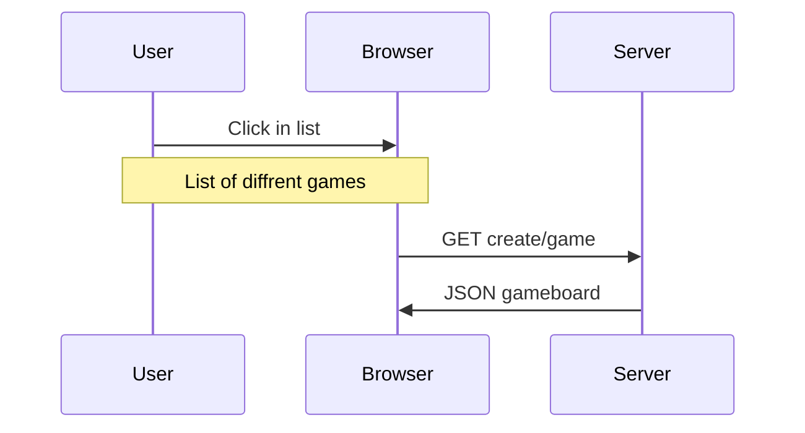
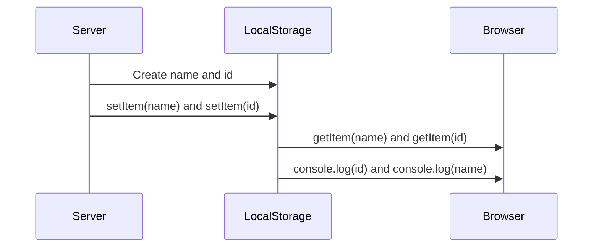

# Grupp5-Gomoku

## Sekvens diagram

Plugin: Markdown Preview Mermaid Support

Länk till dokumentation: https://mermaid.js.org/syntax/sequenceDiagram.html

#### GET request with fetch

#### LocalStorage

